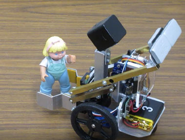
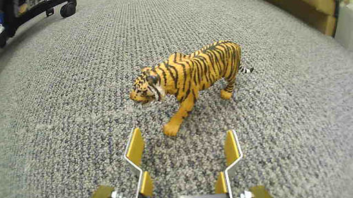
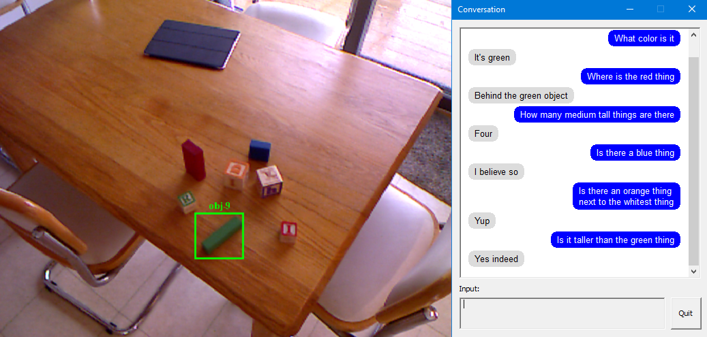
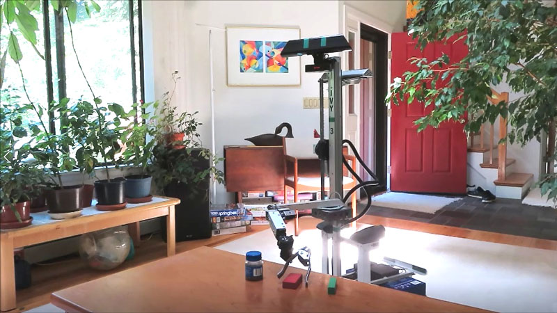
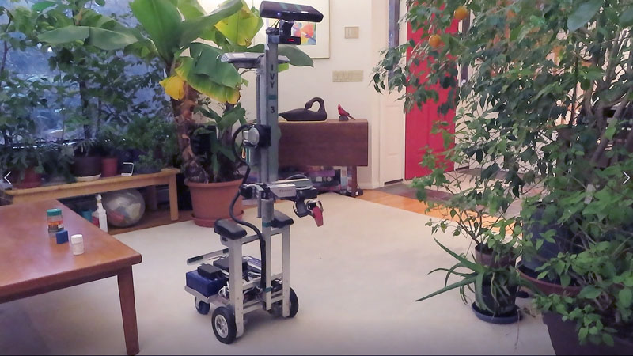

# ALIA
## Architecture for Linguistic Interaction and Augmentation

The secret to AI is that there is no secret -- it is all programming, but the programming is done by other members of your culture! To this end ALIA provides an end-to-end symbolic cognitive system that is able to learn from natural language instructions via text or speech. 

Some examples of ALIA's use (and related papers) can be found at:

* Advice taking [video](https://youtu.be/EjzdjWy3SKM) and [paper](https://arxiv.org/abs/1911.09782)

* Guided perception [video](https://youtu.be/jZT1muSBjoc) and [paper](https://arxiv.org/abs/1911.11620)

 

To try out the system, first download the latest release of [MensEt](https://github.com/jconnell11/ALIA/releases/download/v4.90/MensEt_v490.zip) and unzip it to some folder. You will also need a bunch of [DLLs](https://github.com/jconnell11/ALIA/releases/download/v4.80/MensEt_DLL.zip) and the Visual C++ 2019 [runtime](https://aka.ms/vs/16/release/vc_redist.x64.exe). After this start up the program MensEt.exe, select menu option "Demo / Local Text File", and pick something like [1-dance.tst](robot/MensEt/test/1-dance.tst). Hit ENTER to go on to the next sentence. You can also free-form type to the system using menu opton "Demo / > Interact Local". If ALIA does not understand you, it is likely you need to add some particular word to the [vocabulary.sgm](robot/MensEt/language/vocabulary.sgm) text file.

If you want to get fancier, you can switch over to speech mode. Use menu selection "Demo / Demo Options" and set "Read output always" to 1 to enable text-to-speech (native to Windows). You can also set "Speech (none, local, web)" to either 1 or 2. Option 1 uses Windows' built-in speech recognition (old and not very accurate). Option 2 ties into Microsoft's Azure online speech recognition, but you must first [set up an account](https://ms.portal.azure.com/#create/Microsoft.CognitiveServicesSpeechServices) then save your credentials in text file [sp_reco_web.key](robot/MensEt/sp_reco_web.key). For some guidance on what to say, see [this sheet](robot/MensEt/Robot_Dialog.pdf).

Also available is the lastest release of the [Banzai](https://github.com/jconnell11/ALIA/releases/download/v4.90/Banzai_v490.zip) program and its [DLLs](https://github.com/jconnell11/ALIA/releases/download/v4.80/Banzai_DLL.zip). This uses the same NLU and reasoning engines, but controls a larger mobile manipulator, [ELI](robot/Banzai/ELI_robot.jpg). It is included here because it demonstrates how to create a "grounding" for a different physical robot via classes such as [jhcBallistic.cpp](robot/common/Grounding/jhcBallistic.cpp). 
To try this out (without a robot) use menu selection "File / Open Video" and select [environ/blocks_t512.bmp](robot/Banzai/environ/blocks_t512.bmp). Then do "Demo / Text File" with [blocks_demo.tst](robot/Banzai/test/blocks_demo.tst). Keep hitting ENTER to go on to the next sentence. You should get the responses shown above. 

Recently long term memory has been added. You can tell the system something like "Joe's wife is Jill" then "Remember that". All facts, rules, and operators are stored in the KB subdirectory. The next time you start the program you can ask "Who is Joe's wife" and get the proper answer. Simple typo correction and vocabulary inference have also been added. 

If you have an ELI robot (which almost no one does), there are reasonably competent manipulation routines as demonstrated in this [video](https://youtu.be/9sdTyfvoMPg). You can also craft full behaviors conversationally, including iterative constructs like "all", as shown [here](https://youtu.be/Yoq7n6lGhYo).

ALIA is implemented in [Visual C++ 2019](https://visualstudio.microsoft.com/thank-you-downloading-visual-studio/?sku=Community&rel=16) (free) and should compile cleanly with the files here. However, to actually run the system you will need some data files (e.g. the KB0 directory) and a slew of DLLs. The zip archives under the v4.80 release can be used for all versions.

---

January 2023 - Jonathan Connell - jconnell@alum.mit.edu

