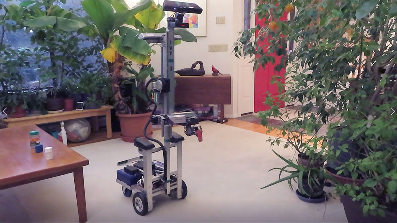
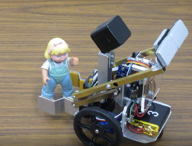
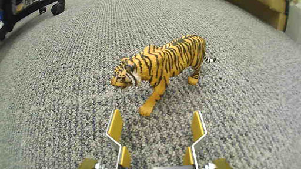
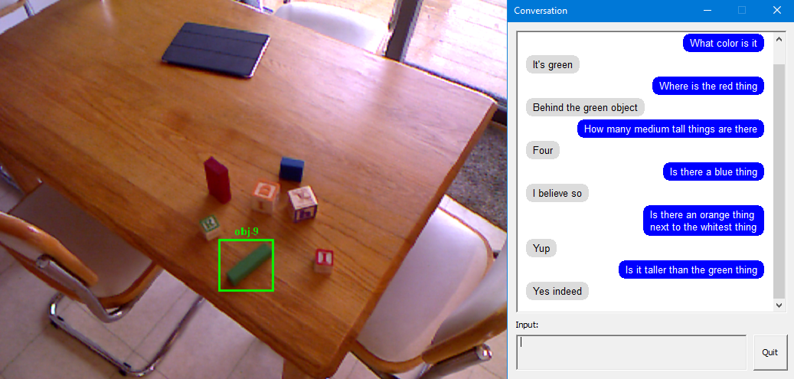
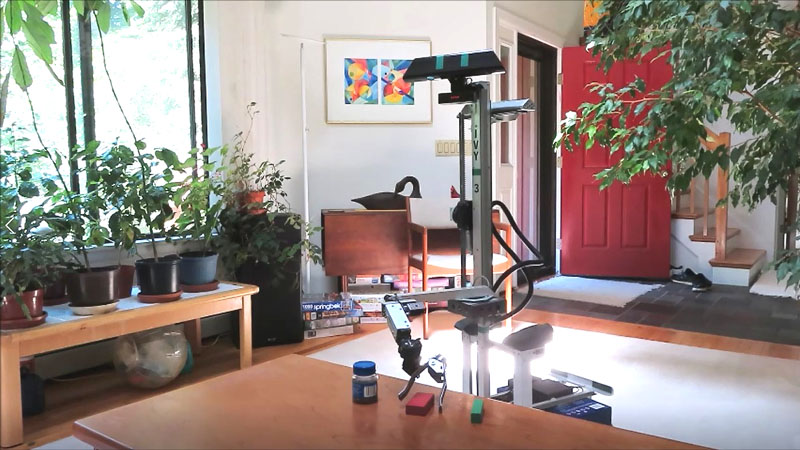

# ALIA
## Architecture for Linguistic Interaction and Augmentation

Although there are now now sophisticated deep-learning [frameworks](https://github.com/huggingface/lerobot) for robot control, ALIA provides an alternative interaction style much more like command line scripting. There is no need to cajole the system with carefully  engineered prompts, and no hallucination. Moreover, the system runs locally on-board (except for [speech](https://youtu.be/qWLANb0PmbM) recognition) and can work on inexpensive [platforms](https://github.com/jconnell11/Ganbei) ($450)

ALIA starts from the viewpoint that intelligence is all just programming, but the programming is done by other members of your culture. To enable this, the code provides an end-to-end symbolic cognitive system that is able to learn from natural language instructions via text or speech. It can acquire specific likes and dislikes, generic problem solving skills, and socially appropriate reactions, as shown in this [video](https://youtu.be/Yoq7n6lGhYo). 

Building an agent by incrementally uploading (as opposed to DNN batch training) allows many opportunities for debugging so that the final product is not alien, but more like a probabitionary member of society. You can read about the basic system design philosophy [here](https://arxiv.org/abs/1911.09782).

## Capabilities

ALIA is good at learning sequential procedures, but it can also understand action prohibitions and even ignore certain users, as shown in this 
[video](https://youtu.be/EjzdjWy3SKM). Yet often the information needed to accomplish some task is not readily apparent, but instead must be sought out. Fortunately, ALIA can [take advice](https://arxiv.org/abs/1911.11620) about what sensing actions to perform, as illustrated in this [demo](https://youtu.be/jZT1muSBjoc) of guided perception.

| prohibitions | guided perception |
| --- | --- |
|  |  |

ALIA can also perform visual question answering as shown in the interaction below. This involves active information gathering, spatial inference, and hypothesis testing. To appreciate the complexity of the reasoning process, you can download the Banzai program (see below) and try some of your own questions while watching the log console.

But it is not just about questions, ALIA can also orchestrate moderately sophisticated actions like stacking objects. In this [video](https://youtu.be/9sdTyfvoMPg) the user issues a basic verbal command then the robot automatically coordinates various visual analysis, trajectory planning, and body motion activties to accomplish the task. 

ALIA has even more capabilities beyond the ones shown here.
You can craft full behaviors conversationally, including iterative constructs like "all" and parallel constructs like "while". And there is a rudimentary editing system so you can say things like "No, don't grab it, point at it instead". There is also limited vocabulary (POS) inference and the text input panel has simple typo correction.
Finally, the system has long term memory so you can tell it something like "Joe's wife is Jill" then "Remember that". Since all facts, rules, and operators get stored in the KB subdirectory, the next time you start the program you can ask "Who is Joe's wife" and get the proper answer. 

## Development GUI

The main development tool for ALIA is the [Banzai](robot/Banzai) program, which runs under Windows. It was built to control the [ELI](doc/ELI_construction) class of homebrew robots, yet it can be run standalone as well. It is useful in this capacity since it shows many aspects of the internal state and lets you adjust numerous parameters. The system can be compiled with  [Visual C++ 2022](https://aka.ms/vs/17/release/vs_community.exe) Community (free), but there is also a pre-compiled executable. To run the program, from the project directory download [Banzai.exe](robot/Banzai/Banzai.exe), all __*.dll__ files, and the various subdirectories like [KB0](robot/Banzai/KB0). You will also need to install the Visual C++ 2022 [runtime](https://aka.ms/vs/17/release/vc_redist.x64.exe)

To try out the system, start the program and use menu selection "File / Open Video" to load test image [environ/blocks_t512.bmp](robot/Banzai/environ/blocks_t512.bmp). Then do "Demo / Text File" with [blocks_demo.tst](robot/Banzai/test/blocks_demo.tst), hitting ENTER to go on to each next sentence. You can also try other tests such as [dont_grab.tst](robot/Banzai/test/dont_grab.tst) in the same way. For free-form typing instead of canned text, use menu opton "Demo / > Interactive". If ALIA does not understand you, it is likely you need to add some particular word to the [vocabulary.sgm](robot/Banzai/language/vocabulary.sgm) text file. You can also enable local text-to-speech with the "Demo / Demo Options" menu and setting "Read output always" to 1.

In addition to text mode, the system is designed to be used with Microsoft's Azure online speech recognition. This is essentially __free__ for low intensity usage, but you will need credentials to access this on-line service. Start by signing up [here](https://portal.azure.com/#create/Microsoft.CognitiveServicesSpeechServices) (possibly making a Microsoft account first) then select "Speech Services" and "+ Create". Finally, click "Manage keys" to find valid "Key" and "Location" strings. For the Windows version of things, these strings should be substituted in the text file [config/sp_reco_web.key](robot/Banzai/config/sp_reco_web.key). By default speech recognition is off, but you can use "Demo / Demo Options" to set "Speech" to 2 (web). 

## Embedded Libraries

To integrate ALIA with your own robot use the [alia_vis](audio/common/API/alia_vis.h) library. This interfaces to an external robot through a pile of variables, and has some built-in processing for depth images to allow simple manipulation and navigation. The related projects [__Wansui__](https://github.com/jconnell11/Wansui) (ROS) and [__Ganbei__](https://github.com/jconnell11/Ganbei) (Python) show how to use the [Linux version](deriv/alia_vis/libalia_vis.so) on two affordable commercial robots.

The Linux shared library can be rebuilt with Visual Studio and the solution file [alia_vis_ix.sln](deriv/alia_vis/alia_vis_ix.sln). But to properly cross-compile you must first install the Windows Subsystem for Linux by opening a command line and typing:

    wsl --install -d Ubuntu-18.04

You then need to start the local copy of Ubuntu and install the gcc/g++ compiler for ARM64 using the command:

    sudo apt-get install g++-aarch64-linux-gnu

The pure Windows [DLL](deriv/alia_vis/alia_vis.dll) only needs Visual Studio and the solution file [alia_vis.sln](deriv/alia_vis/alia_vis.sln). 

---

May 2026 - Jonathan Connell - jconnell@alum.mit.edu

